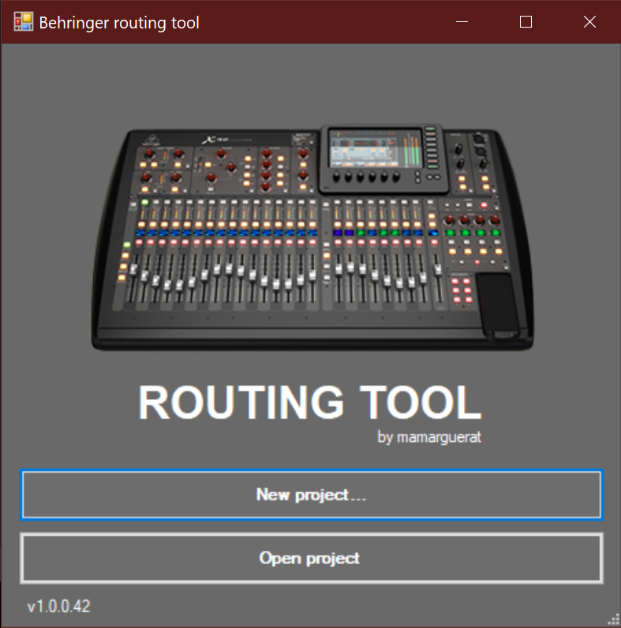
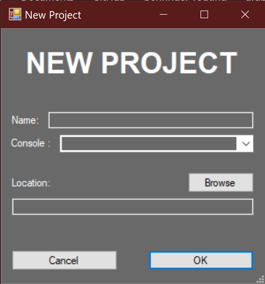
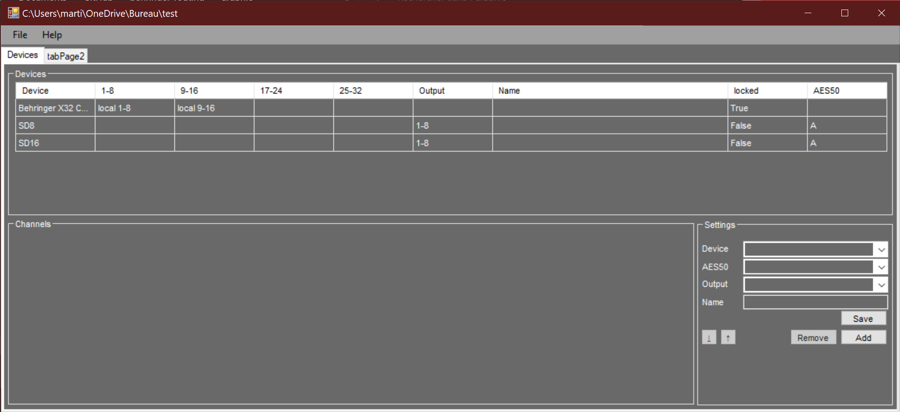

# Behringer routing tool
A tool to simplify routing with behringer x-consoles, midas m-consoles and behringer wing.

## Simplify routing
- This tool has a user friendly user interface to simplify routing
- All routing is linked to hardware devices to avoid errors

## Generate files
- `.scn` files generation
- `.pdf` documentation generation

### Documentation generation
This tool can generate `.pdf` files for documenting the routing. The documentation contain physical connexions, console routing and faders routing

# Notes
_This project is under developement and may not be working at the moment. Please always use latest release to avoid any problems_

## Contributions
I will not accept any contributions until I have a working prototype

## Issues
Feel free to report any issues or suggestions you have

# Screenshots
**NOTE** This project is under developement. These screenshots could not be the final application

